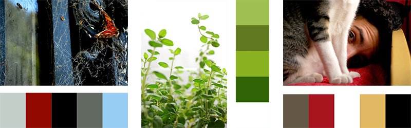

# A little bit of color!

###How to create a great palette for your app/web...

You may have never payed close attention to the colors you pick for your web or app, but having a good palette helps organizinge information in your site.The idea behind this post is not to give an introduction to color theory but to offer a simple guide to help you create an harmonious and useful palette. 

###What does a good palette look like?

Well, it depends on what we need. We have to think of color as an aid to organize information, for instance having different sections and identifying them more easily or drawing the user’s attention to take a specific action. 

The first step to create our palette is understanding how it’s composed: basically we have 2 main color groups, neutral and highlights. The first group can be used on large blocks (our main, footer, header, texts, etc.). And the second one is ideal for smaller elements that need to draw attention, such as buttons, links and call to actions.

The lightest and darkest colors we pick should follow the hue chosen for our neutral colors. For example, black and white, or dark grey and white, or if we want a little bit more color, a dark blue like in the example above. It’s important for them to have a big contrast between them to allow an easy reading experience.

###How to generate a cool palette?

There are a number of ways to generate a palette:

- You can find one you like on http://colorhunt.co/ and tune it according to your needs by adding or removing colors.
- You can play around with: http://www.colourco.de/ and generate palettes through triads and quads.
- You can choose colors one by one (we will go over how to do this in a bit).
- You can choose a picture with colors that you find nice and are suitable for your web and take your palette from it.

As promised, let’s create a whole palette in 3 simple steps:

  1. The first step is to choose a specific color. This could be our company logo’s or brand color. If you don’t have a brand color we must pick one, it could simply be a color we like or do a market research to find the one that would fit our web. There are tons of information on the web about the color meanings as well as research on the colors most frequently used by large corporations that can help you take a decision. I’m gonna pick 10Pines’ brand color: #7EC247

  2. The second step involves picking a second and/or third highlight color. This will be a support color used when we need to show a secondary interaction for the user. A good way to look for these colors is finding the complementary color or creating a triad or quad based on the color we chose on the previous step. Don’t be afraid, these pages can help you with it: 
    - http://colorschemedesigner.com/csd-3.5/ 
    - http://www.colourlovers.com/copaso/ColorPaletteSoftware

    
 
    Or you can choose another color you like. Mine will be: #F7931E 

  3. The last step is to generate our neutral colors, they could simply be a grey scale or we can chose a different color, preferably with low saturation, and generate a  gradient from it. I will go ahead and pick a grey scale, ending up with the following palette:

    

Before saying goodbye, I would like to show you a couple of examples generated from photographs. These are mine, but there is no need for you to go out and take pictures for this, you can just get them on the internet.

This web will help you extract a palette from a image: http://www.pictaculous.com/.

Finally, keep in mind that having a good palette will help you organize the information we offer to the user hierarchically. I’ll leave how to properly use this palette for another post.  
